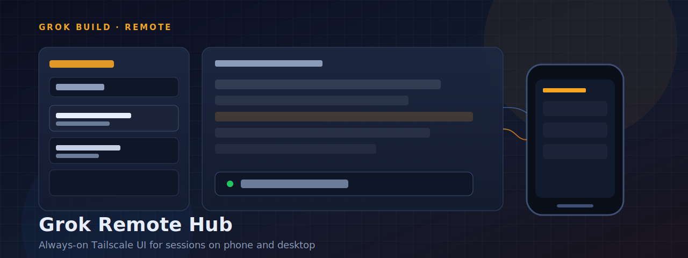
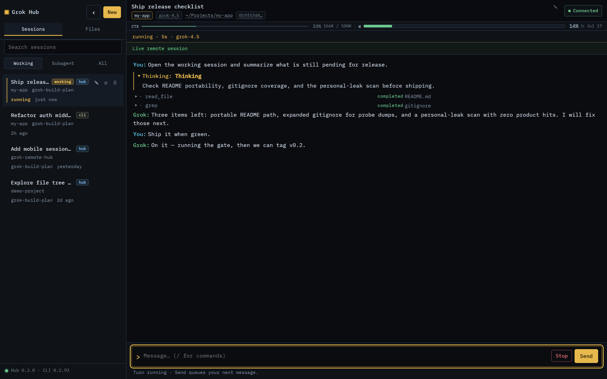
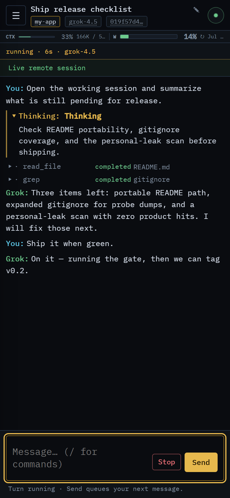
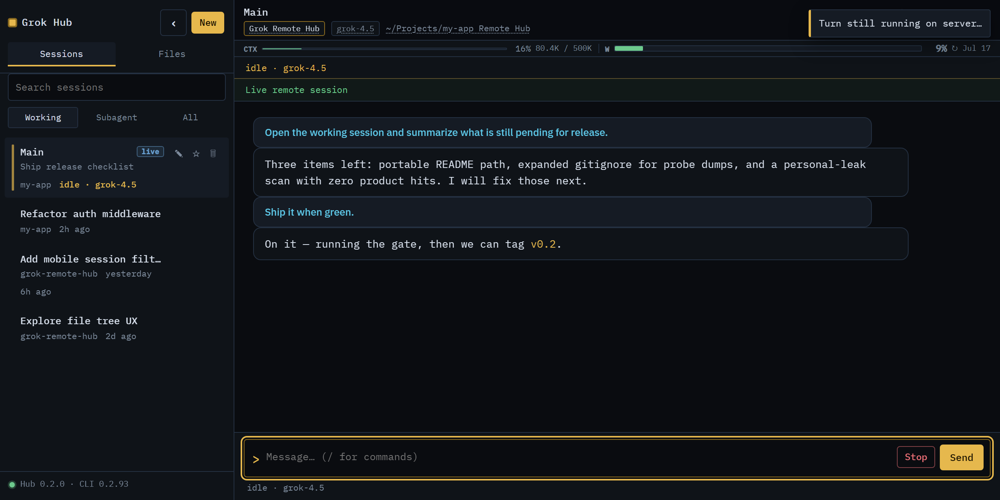
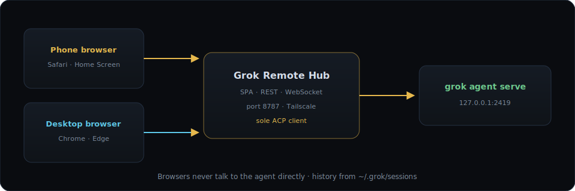

# Grok Remote Hub

<p align="center">
  
</p>

<p align="center">
  <strong>Always-on remote control plane for <a href="https://x.ai/">Grok Build</a></strong><br>
  Resume sessions from phone or desktop · live multi-browser stream · ACP health · honest compact
</p>

<p align="center">
  <a href="https://github.com/ChrisP-Builds/grok-remote-hub/releases/tag/v0.4.0"></a>
  <a href="LICENSE"></a>
  <a href="#requirements"></a>
  <a href="#requirements"></a>
  <a href="https://tailscale.com/"></a>
  <a href="https://github.com/ChrisP-Builds/grok-remote-hub"></a>
</p>

<p align="center">
  
</p>

> **Security first:** the hub auto-approves agent tools. Anyone who can reach it can drive an agent with the same power as a local Grok session. Prefer **Tailscale** + optional `hub_token`. See [Security](#security).

---

## Screenshots

<p align="center">
  
  <br>
  <em>Desktop — session rail, filters, live transcript, usage bars</em>
</p>

<p align="center">
  
  &nbsp;&nbsp;&nbsp;
  
  <br>
  <em>Phone viewport · wide product preview</em>
</p>

Demo content in screenshots is sanitized for the public repo (no personal paths or private session titles).

---

## Why this exists

The stock Grok CLI TUI is excellent on the desktop, but it is a **single local process**. Remote Hub is the thin, always-on control surface when you want:

| You want… | Remote Hub |
|---|---|
| Chat from **Safari / phone** while the agent runs on the PC | Yes (Tailscale) |
| **Phone + desktop browser** seeing the same live stream | Yes (WebSocket fan-out) |
| Resume **saved sessions** and project history | Yes (`~/.grok/sessions`) |
| Inject prompts into the **stock Grok TUI** | **No** (separate process) |

**Hub = remote control plane for the agent stream** (health, turns, compact, plan, files), not full TUI parity.

---

## Features

- **Session rail** — Working / Subagent / All, search, pin, rename, delete; restore last chat on refresh
- **New session** — Projects | Browse folder picker with Recent, breadcrumbs, and **Use this folder**
- **Live stream** — multi-browser WebSocket fan-out; mid-turn switch keeps continuity; turn stop/clear cancels agent (CLI-aligned); wake re-syncs stuck turns
- **Agent status** — pill and `/health` distinguish process up vs ACP connected **and** ACP quality (`ok`/`stale`/`zombie`); auto-reconnect when process is up; after heal exhaustion, **click the hung pill** to restart the agent serve (hub stays up)
- **Honest `/compact`** — same ACP compact path as the CLI remote; feedback grounded in session `signals.json` (not cheerful no-ops)
- **Plan mode (Hub)** — View plan appears **inline** when awaiting/Active; Approve writes `plan_mode.json` (not stock TUI `exit_plan_mode`)
- **History** — hydrate from `updates.jsonl` when you open a session; load quiet-period suppress avoids history flood thrash
- **Composer** — multi-line input, slash palette, paperclip upload, prompt queue while a turn runs
- **Files** — sandboxed tree for the session cwd (edit, markdown + Mermaid, images, video preview, Share/Save)
- **Site preview** — double-click or **Preview** on `.html` / `.htm` in the Files tree, or **Preview** on a tool row when an HTML path is present; same-origin Python serve (relative CSS/JS work on Tailscale/phone); Close stops the preview
- **Usage** — session context bar from session `signals.json` (not compact-op toast metrics) + weekly plan bar (local Grok login); large sessions can match CLI first-token cost after `session/prompt`
- **Ops scripts** — detached start / stop / restart, firewall helper, logon task
- **Terminal follower** — `follow.ps1` tails the same session in a desktop terminal
- **Browser Preview Hub** — optional standalone Node companion for static sites / SPAs (iframe chrome, device presets) outside the hub UI; see [tools/preview-hub/README.md](tools/preview-hub/README.md). Prefer in-hub Preview for files under a session cwd.

```bash
npm run preview
# or
node tools/preview-hub/server.mjs --open
```

Node 18+ (ES modules), stdlib only. Separate from the Python hub on `:8787`.

---

## Architecture

<p align="center">
  
</p>

- **Sole ACP client** — browsers never talk to the agent directly
- **Sole-writer prompts** — live turns use hub-owned `session/new`
- **Dual browser, not dual TUI** — phone + desktop share this process; stock TUI is separate

Design write-ups: **[docs/adr/](docs/adr/)** (ADR 001–016).

| Path | Live together? | Notes |
|---|---|---|
| Safari hub ↔ desktop **browser** hub | Yes | Same process; WS fan-out |
| Safari hub → **stock Grok CLI TUI** | No | Separate process |
| Safari hub → **desktop terminal follower** | Yes | Read-only `updates.jsonl` tail |

---

## Requirements

| Need | Notes |
|---|---|
| **Windows** PC | Start/stop scripts use WMI / firewall / scheduled tasks |
| **Grok Build** | `grok` on PATH or `%USERPROFILE%\.grok\bin\grok.exe` |
| **Python 3.11+** | Hub runtime |
| **Tailscale** (recommended) | Phone / remote browser on your tailnet |

---

## Quick start

```powershell
git clone https://github.com/ChrisP-Builds/grok-remote-hub.git
cd grok-remote-hub

python -m venv .venv
.\.venv\Scripts\pip install -r requirements.txt

# optional local overrides (gitignored)
copy config.example.toml config.toml

.\start-hub.ps1
```

Open the URL printed by the script (port **8787**):

```text
http://100.x.y.z:8787          # Tailscale
http://127.0.0.1:8787          # this PC only
```

| Action | Command |
|---|---|
| Stop | `.\stop-hub.ps1` |
| Restart (safe from a hub session) | `.\restart-hub.ps1` |
| Start at Windows logon | `.\install-startup.ps1` |

> **Do not** run bare `stop-hub.ps1` from inside a live hub/agent turn. Use `restart-hub.ps1` so stop+start is scheduled and survives the hub exiting.

---

## Use from your phone

1. Install **Tailscale** on the PC and phone (same account / tailnet).
2. Start the hub on the PC. Confirm it prints `Hub is up` and health checks show `OK`.
3. **Once, as Administrator**, open the firewall:

   ```powershell
   .\fix-firewall.ps1
   ```

4. On the phone (Tailscale connected):

   ```text
   http://<tailscale-ip>:8787
   ```

5. Optional: **Add to Home Screen** for an app-like shell.
6. Pick a session under **Working**, wait for history + load, then chat.

### If Safari still will not load

| Check | What to do |
|---|---|
| Hub dead | On PC: `.\start-hub.ps1`, then try `http://127.0.0.1:8787` |
| Firewall | Run `.\fix-firewall.ps1` **as Administrator** |
| Tailscale | Phone Connected; same account as the PC |
| URL | Must include `:8787` and `http://` (not https) unless Serve is set up |
| Optional HTTPS | Tailscale Serve → `tailscale serve --bg http://127.0.0.1:8787` |

Without Tailscale the hub binds **localhost only** and the UI shows **Local only**.

---

## Security

**This hub auto-approves agent tools** (`grok agent --always-approve serve`). Treat network access like handing someone your keyboard.

1. Prefer **Tailscale only** (default never binds `0.0.0.0`).
2. Set optional **`hub_token`** in `config.toml`:

   ```toml
   [hub]
   hub_token = "long-random-string"
   ```

   Then open `http://…:8787?token=long-random-string` (or send `Authorization: Bearer …`).

3. Agent listens on **`127.0.0.1` only**; secret file `data/agent.secret` is gitignored.

Full policy: **[SECURITY.md](SECURITY.md)**.

---

## Configuration

| Setting | Default | Purpose |
|---|---|---|
| `hub.bind_port` | `8787` | UI HTTP/WS port |
| `hub.bind_host` | auto | Localhost + Tailscale IPv4 when available |
| `hub.hub_token` | empty | Optional shared secret for UI access |
| `hub.projects_root` | `~/Projects` | Project folders for New Session |
| `hub.sessions_root` | `~/.grok/sessions` | On-disk session index |
| `agent.bind` / `port` | `127.0.0.1:2419` | Local `grok agent serve` |

Copy `config.example.toml` → `config.toml` for local overrides.

After a **CLI upgrade**, check the **Hub · CLI** badge, or `GET /api/compat` / `POST /api/compat/refresh`.

---

## Desktop terminal follower

```powershell
.\follow.ps1
.\follow.ps1 --session <session-uuid>
.\follow.ps1 --cwd "C:\path\to\your\project"
```

Ctrl+C exits cleanly (read-only on disk; does not stop the hub).

---

## Development

```powershell
python -m venv .venv
.\.venv\Scripts\pip install -r requirements.txt
.\.venv\Scripts\pip install -r requirements-dev.txt
.\.venv\Scripts\python -m pytest -q
.\.venv\Scripts\python -m hub
```

Live UI smoke (hub already on `:8787`):

```powershell
python -m playwright install chromium
python -m pytest tests/test_e2e_smoke.py -v
```

Prefer **Python Playwright**. Optional Node Playwright can hang on some Windows/Node builds.

See **[CHANGELOG.md](CHANGELOG.md)** (public release history), **[CONTRIBUTING.md](CONTRIBUTING.md)**, and **[docs/RELEASE_READINESS.md](docs/RELEASE_READINESS.md)**.

---

## Known limits (v0.4)

- **Multi-project concurrent live turns** supported (default max 3 different project cwds; configure `max_concurrent_turns` under `[hub]`). Same-project follow-ups still queue. Sole ACP connection; multi-process agent pool is a future scale-out if needed.
- Cancel is best-effort (depends on agent support)
- History / session list caps (defaults suitable for a personal hub)
- **Windows-first** ops scripts

---

## Privacy note (plan usage)

The hub may read `~/.grok/auth.json` on this machine (same login as the Grok CLI) to show the weekly plan usage bar. Access and refresh tokens are **not** returned in API responses or browser payloads.

---

## License

[MIT](LICENSE) © ChrisP-Builds

Issues and PRs welcome. Keep secrets and personal machine paths out of the tree.
